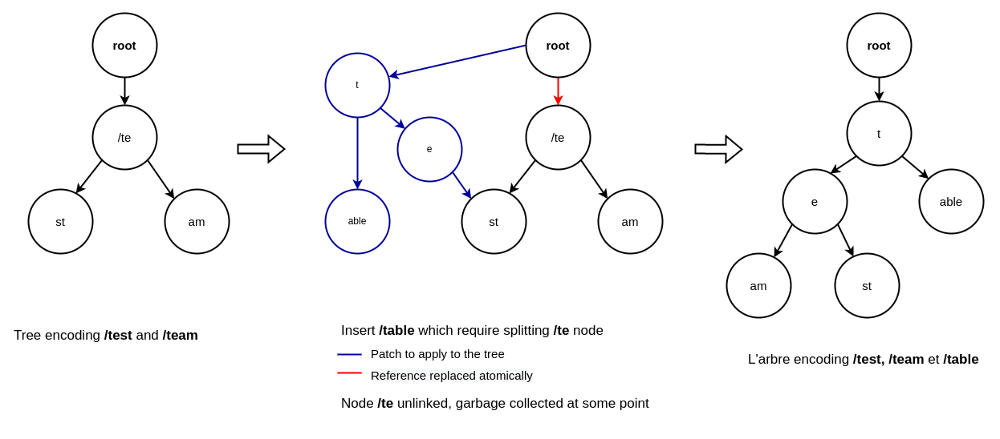

[](https://pkg.go.dev/github.com/tigerwill90/fox)
[](https://github.com/tigerwill90/fox/actions?query=workflow%3Atests)
[](https://goreportcard.com/report/github.com/tigerwill90/fox)
[](https://codecov.io/gh/tigerwill90/fox)
# Fox
Fox is a lightweight high performance HTTP request router for [Go](https://go.dev/). The main difference with other routers is
that it supports **mutation on its routing tree while handling request concurrently**. Internally, Fox use a 
[Concurrent Radix Tree](https://github.com/npgall/concurrent-trees/blob/master/documentation/TreeDesign.md) that support **lock-free 
reads** while allowing **concurrent writes**.

The router tree is optimized for high-concurrency and high performance reads, and low-concurrency write. Fox has a small memory footprint, and 
in many case, it does not do a single heap allocation while handling request.

## Disclaimer
The current api is not yet stabilize. Breaking changes may occur before `v1.0.0` and will be noted on the release note.

## Features
**Routing mutation:** Register, update and remove route handler safely at any time without impact on performance. Fox never block while serving
request!

**Wildcard pattern:** Route can be registered using wildcard parameters. The matched path segment can then be easily retrieved by 
name. Due to Fox design, wildcard route are cheap and scale really well.

**Detect panic:** You can register a fallback handler that is fire in case of panics occurring during handling an HTTP request.

**Get the current route:** You can easily retrieve the route for the current matched request. This actually makes it easier to integrate
observability middleware like open telemetry (disable by default).

**Only explicit matches:** Inspired from [httprouter](https://github.com/julienschmidt/httprouter), a request can only match
exactly one or no route. As a result there are no unintended matches, and it also encourages good RESTful api design.

**Redirect trailing slashes:** Inspired from [httprouter](https://github.com/julienschmidt/httprouter), the router automatically 
redirects the client, at no extra cost, if another route match with or without a trailing slash (disable by default). 

**Path auto-correction:** Inspired from [httprouter](https://github.com/julienschmidt/httprouter), the router can remove superfluous path
elements like `../` or `//` and automatically redirect the client if the cleaned path match a handler (disable by default).

Of course, you can also register custom `NotFound` and `MethodNotAllowed` handlers.

## Getting started
### Installation
```shell
go get -u github.com/tigerwill90/fox
```

### Basic example
````go
package main

import (
	"fmt"
	"github.com/tigerwill90/fox"
	"log"
	"net/http"
)

var WelcomeHandler = fox.HandlerFunc(func(w http.ResponseWriter, r *http.Request, params fox.Params) {
	_, _ = fmt.Fprint(w, "Welcome!\n")
})

type HelloHandler struct{}

func (h *HelloHandler) ServeHTTP(w http.ResponseWriter, r *http.Request, params fox.Params) {
	_, _ = fmt.Fprintf(w, "Hello %s\n", params.Get("name"))
}

func main() {
	r := fox.New()

	Must(r.Handler(http.MethodGet, "/", WelcomeHandler))
	Must(r.Handler(http.MethodGet, "/hello/:name", new(HelloHandler)))

	log.Fatalln(http.ListenAndServe(":8080", r))
}

func Must(err error) {
	if err != nil {
		panic(err)
	}
}
````
#### Error handling
Since new route may be added at any given time, Fox, unlike other router, does not panic when a route is malformed or conflicts with another. 
Instead, it returns the following error values
```go
ErrRouteExist    = errors.New("route already registered")
ErrRouteConflict = errors.New("route conflict")
ErrInvalidRoute  = errors.New("invalid route")
```

Conflict error may be unwrapped to retrieve conflicting route.
```go
if errors.Is(err, fox.ErrRouteConflict) {
    matched := err.(*fox.RouteConflictError).Matched
    for _, route := range matched {
        fmt.Println(route)
    }
}
```

#### Named parameters
A route can be defined using placeholder (e.g `:name`). The values are accessible via `fox.Params`, which is just a slice of `fox.Param`.
The `Get` method is a helper to retrieve the value using the placeholder name.

```
Pattern /avengers/:name

/avengers/ironman       match
/avengers/thor          match
/avengers/hulk/angry    no match
/avengers/              no match

Pattern /users/uuid_:id

/users/uuid_xyz         match
/users/uuid             no match
```

#### Catch all parameter
Catch-all parameters can be used to match everything at the end of a route. The placeholder start with `*` followed by a name.
```
Pattern /src/*filepath

/src/                   match
/src/conf.txt           match
/src/dir/config.txt     match
```

#### Warning about params slice
`fox.Params` slice is freed once ServeHTTP returns and may be reused later to save resource. Therefore, if you need to hold `fox.Params`
longer, use the `Clone` methods.
```go
func (h *Handler) ServeHTTP(w http.ResponseWriter, r *http.Request, params fox.Params) {
	p := params.Clone()
	go func(){
		time.Sleep(1 * time.Second)
		log.Println(p.Get("name")) // Safe
	}()
	_, _ = fmt.Fprintf(w, "Hello %s\n", params.Get("name"))
}
```

### Adding, updating and removing route
In this example, the handler for `route/:action` allow to dynamically register, update and remove handler for the given route and method.
Due to Fox design, those actions are perfectly safe and may be executed concurrently. 

```go
package main

import (
	"encoding/json"
	"fmt"
	"github.com/tigerwill90/fox"
	"log"
	"net/http"
	"strings"
)

type ActionHandler struct {
	fox *fox.Router
}

func (h *ActionHandler) ServeHTTP(w http.ResponseWriter, r *http.Request, params fox.Params) {
	var data map[string]string
	if err := json.NewDecoder(r.Body).Decode(&data); err != nil {
		http.Error(w, err.Error(), http.StatusBadRequest)
		return
	}

	method := strings.ToUpper(data["method"])
	path := data["path"]
	text := data["text"]

	if path == "" || method == "" {
		http.Error(w, "missing method or path", http.StatusBadRequest)
		return
	}

	var err error
	action := params.Get("action")
	switch action {
	case "add":
		err = h.fox.Handler(method, path, fox.HandlerFunc(func(w http.ResponseWriter, r *http.Request, params fox.Params) {
			_, _ = fmt.Fprintln(w, text)
		}))
	case "update":
		err = h.fox.Update(method, path, fox.HandlerFunc(func(w http.ResponseWriter, r *http.Request, params fox.Params) {
			_, _ = fmt.Fprintln(w, text)
		}))
	case "delete":
		err = h.fox.Remove(method, path)
	default:
		http.Error(w, fmt.Sprintf("action %q is not allowed", action), http.StatusBadRequest)
		return
	}
	if err != nil {
		http.Error(w, err.Error(), http.StatusConflict)
		return
	}

	_, _ = fmt.Fprintf(w, "%s route [%s] %s: success\n", action, method, path)
}

func main() {
	r := fox.New()
	Must(r.Handler(http.MethodPost, "/routes/:action", &ActionHandler{fox: r}))
	log.Fatalln(http.ListenAndServe(":8080", r))
}

func Must(err error) {
	if err != nil {
		panic(err)
	}
}
```

## Concurrency
Fox implements a [Concurrent Radix Tree](https://github.com/npgall/concurrent-trees/blob/master/documentation/TreeDesign.md) that supports **lock-free** 
reads while allowing **concurrent writes**, by calculating the changes which would be made to the tree were it mutable, and assembling those changes 
into a **patch**, which is then applied to the tree in a **single atomic operation**.

For example, here we are inserting the new path `toast` into to the tree which require an existing node to be split:

<p align="center" width="100%">
    
</p>

When traversing the tree during a patch, reading threads will either see the **old version** or the **new version** of the (sub-)tree, but both version are 
consistent view of the tree.

#### Other key points

- Routing requests is lock-free (reading thread never block, even while writes are ongoing)
- The router always see a consistent version of the tree while routing request
- Reading threads do not block writing threads (adding, updating or removing a handler can be done concurrently)
- Writing threads block each other but never block reading threads

As such threads that route requests should never encounter latency due to ongoing writes or other concurrent readers.

## Working with http.Handler
Fox itself implements the `http.Handler` interface which make easy to chain any compatible middleware before the router. Moreover, the router
provides convenient `fox.WrapF` and `fox.WrapH` adapter to be use with `http.Handler`. Named and catch all parameters are forwarded via the
request context
```go
_ = r.Handler(http.MethodGet, "/users/:id", fox.WrapF(func(w http.ResponseWriter, r *http.Request) {
    params := fox.ParamsFromContext(r.Context())
    _, _ = fmt.Fprintf(w, "user id: %s\n", params.Get("id"))
}))
```

## Benchmark
The primary goal of Fox is to be a lightweight, high performance router which allow routes modification while in operation. 
The following benchmarks attempt to compare Fox to various popular alternatives. Some are fully featured web framework, and other
are lightweight request router. This is based on [julienschmidt/go-http-routing-benchmark](https://github.com/julienschmidt/go-http-routing-benchmark) 
repository.

### Config
```
GOOS:   Linux
GOARCH: amd64
GO:     1.19
CPU:    Intel(R) Core(TM) i9-9900K CPU @ 3.60GHz
```
### Static Routes
It is just a collection of random static paths inspired by the structure of the Go directory. It might not be a realistic URL-structure.

**GOMAXPROCS: 0**
```
BenchmarkDenco_StaticAll                                  352584              3350 ns/op               0 B/op          0 allocs/op
BenchmarkHttpRouter_StaticAll                             159259              7400 ns/op               0 B/op          0 allocs/op
BenchmarkKocha_StaticAll                                  154405              7793 ns/op               0 B/op          0 allocs/op
BenchmarkFox_StaticAll                                    130474              8899 ns/op               0 B/op          0 allocs/op
BenchmarkHttpTreeMux_StaticAll                            127754              9065 ns/op               0 B/op          0 allocs/op
BenchmarkGin_StaticAll                                     96139             12393 ns/op               0 B/op          0 allocs/op
BenchmarkBeego_StaticAll                                   10000            103464 ns/op           55264 B/op        471 allocs/op
BenchmarkGorillaMux_StaticAll                               2307            501554 ns/op          113041 B/op       1099 allocs/op
BenchmarkMartini_StaticAll                                  1357            886524 ns/op          129210 B/op       2031 allocs/op
BenchmarkTraffic_StaticAll                                   990           1183413 ns/op          753608 B/op      14601 allocs/op
BenchmarkPat_StaticAll                                       972           1193521 ns/op          602832 B/op      12559 allocs/op
```
In this benchmark, Fox performs as well as `Gin`, `HttpTreeMux` and `HttpRouter` which are all Radix Tree based routers. An interesting fact is
that [HttpTreeMux](https://github.com/dimfeld/httptreemux) also support [adding route while serving request concurrently](https://github.com/dimfeld/httptreemux#concurrency).
However, it takes a slightly different approach, by using an optional `RWMutex` that may not scale as well as Fox under heavy load. The next
test compare `HttpTreeMux`, `HttpTreeMux_SafeAddRouteFlag` (concurrent reads and writes), `HttpRouter` and `Fox` in parallel benchmark.

**GOMAXPROCS: 16**
```
Route: /progs/image_package4.out

BenchmarkHttpRouter_StaticSingleParallel-16                      211819790                5.640 ns/op           0 B/op          0 allocs/op
BenchmarkFox_StaticSingleParallel-16                             157547185                7.418 ns/op           0 B/op          0 allocs/op
BenchmarkHttpTreeMux_StaticSingleParallel-16                     154222639                7.774 ns/op           0 B/op          0 allocs/op
BenchmarkHttpTreeMux_SafeAddRouteFlag_StaticSingleParallel-16     29904204                38.52 ns/op           0 B/op          0 allocs/op

Route: all

BenchmarkHttpRouter_StaticAllParallel-16                           1446759                832.1 ns/op           0 B/op          0 allocs/op
BenchmarkHttpTreeMux_StaticAllParallel-16                           997074                 1100 ns/op           0 B/op          0 allocs/op
BenchmarkFox_StaticAllParallel-16                                  1000000                 1105 ns/op           0 B/op          0 allocs/op
BenchmarkHttpTreeMux_SafeAddRouteFlag_StaticAllParallel-16          197578                 6017 ns/op           0 B/op          0 allocs/op
```
As you can see, this benchmark highlight the cost of using higher synchronisation primitive like `RWMutex` to be able to register new route while handling requests.

### Micro Benchmarks
The following benchmarks measure the cost of some very basic operations.

In the first benchmark, only a single route, containing a parameter, is loaded into the routers. Then a request for a URL 
matching this pattern is made and the router has to call the respective registered handler function. End.

**GOMAXPROCS: 0**
```
BenchmarkFox_Param                                      29995566                39.04 ns/op            0 B/op          0 allocs/op
BenchmarkGin_Param                                      30710918                39.08 ns/op            0 B/op          0 allocs/op
BenchmarkHttpRouter_Param                               20026911                55.88 ns/op           32 B/op          1 allocs/op
BenchmarkDenco_Param                                    15964747                70.04 ns/op           32 B/op          1 allocs/op
BenchmarkKocha_Param                                     8392696                138.5 ns/op           56 B/op          3 allocs/op
BenchmarkHttpTreeMux_Param                               4469318                265.6 ns/op           352 B/op         3 allocs/op
BenchmarkBeego_Param                                     2241368                530.9 ns/op           352 B/op         3 allocs/op
BenchmarkPat_Param                                       1788819                666.8 ns/op           512 B/op        10 allocs/op
BenchmarkGorillaMux_Param                                1208638                995.1 ns/op          1024 B/op         8 allocs/op
BenchmarkTraffic_Param                                    606530                 1700 ns/op          1848 B/op        21 allocs/op
BenchmarkMartini_Param                                    455662                 2419 ns/op          1096 B/op        12 allocs/op
```
Same as before, but now with multiple parameters, all in the same single route. The intention is to see how the routers scale with the number of parameters.

**GOMAXPROCS: 0**
```
BenchmarkGin_Param5                                     16470636               73.09 ns/op            0 B/op          0 allocs/op
BenchmarkFox_Param5                                     14716213               82.05 ns/op            0 B/op          0 allocs/op
BenchmarkHttpRouter_Param5                               7614333               154.7 ns/op          160 B/op          1 allocs/op
BenchmarkDenco_Param5                                    6513253               179.5 ns/op          160 B/op          1 allocs/op
BenchmarkKocha_Param5                                    2073741               604.3 ns/op          440 B/op         10 allocs/op
BenchmarkHttpTreeMux_Param5                              1801978               659.2 ns/op          576 B/op          6 allocs/op
BenchmarkBeego_Param5                                    1764513               669.1 ns/op          352 B/op          3 allocs/op
BenchmarkGorillaMux_Param5                                657648                1578 ns/op         1088 B/op          8 allocs/op
BenchmarkPat_Param5                                       633555                1700 ns/op          800 B/op         24 allocs/op
BenchmarkTraffic_Param5                                   374895                2744 ns/op         2200 B/op         27 allocs/op
BenchmarkMartini_Param5                                   403650                2835 ns/op         1256 B/op         13 allocs/op

BenchmarkGin_Param20                                     6136497               189.9 ns/op            0 B/op          0 allocs/op
BenchmarkFox_Param20                                     4187372               283.2 ns/op            0 B/op          0 allocs/op
BenchmarkHttpRouter_Param20                              2536359               483.4 ns/op          640 B/op          1 allocs/op
BenchmarkDenco_Param20                                   2110105               567.7 ns/op          640 B/op          1 allocs/op
BenchmarkKocha_Param20                                    593958                1744 ns/op         1808 B/op         27 allocs/op
BenchmarkBeego_Param20                                    741110                1747 ns/op          352 B/op          3 allocs/op
BenchmarkHttpTreeMux_Param20                              341913                3079 ns/op         3195 B/op         10 allocs/op
BenchmarkGorillaMux_Param20                               282345                3671 ns/op         3196 B/op         10 allocs/op
BenchmarkMartini_Param20                                  210543                5222 ns/op         3619 B/op         15 allocs/op
BenchmarkPat_Param20                                      151778                7343 ns/op         4096 B/op         73 allocs/op
BenchmarkTraffic_Param20                                  113230                9989 ns/op         7847 B/op         47 allocs/op
```

Now let's see how expensive it is to access a parameter. The handler function reads the value (by the name of the parameter, e.g. with a map 
lookup; depends on the router) and writes it to `/dev/null`

**GOMAXPROCS: 0**
```
BenchmarkFox_ParamWrite                                 21061758               56.96 ns/op             0 B/op          0 allocs/op
BenchmarkGin_ParamWrite                                 17973256               66.54 ns/op             0 B/op          0 allocs/op
BenchmarkHttpRouter_ParamWrite                          15953065               74.64 ns/op            32 B/op          1 allocs/op
BenchmarkDenco_ParamWrite                               12553562               89.93 ns/op            32 B/op          1 allocs/op
BenchmarkKocha_ParamWrite                                7356948               156.7 ns/op            56 B/op          3 allocs/op
BenchmarkHttpTreeMux_ParamWrite                          4075486               286.4 ns/op           352 B/op          3 allocs/op
BenchmarkBeego_ParamWrite                                2126341               567.4 ns/op           360 B/op          4 allocs/op
BenchmarkPat_ParamWrite                                  1197910               996.5 ns/op           936 B/op         14 allocs/op
BenchmarkGorillaMux_ParamWrite                           1139376                1048 ns/op          1024 B/op          8 allocs/op
BenchmarkTraffic_ParamWrite                               496440                2057 ns/op          2272 B/op         25 allocs/op
BenchmarkMartini_ParamWrite                               398594                2799 ns/op          1168 B/op         16 allocs/op
```

In those micro benchmarks, we can see that `Fox` scale really well, even with long wildcard routes. Like `Gin`, this router reuse the
data structure (e.g. `fox.Params` slice) containing the matching parameters in order to remove completely heap allocation. We can also
notice that there is a very small overhead comparing to `Gin` when the number of parameters scale. This is due to the fact that every tree's node
in Fox are `atomic.Pointer` and that traversing the tree require to load the underlying node pointer atomically. Despite that, even
with 20 parameters, the performance of Fox is still better than most other contender.

### Github
Finally, this benchmark execute a request for each GitHub API route (203 routes).

**GOMAXPROCS: 0**
```
BenchmarkGin_GithubAll                                     68384             17425 ns/op               0 B/op          0 allocs/op
BenchmarkFox_GithubAll                                     67162             17631 ns/op               0 B/op          0 allocs/op
BenchmarkHttpRouter_GithubAll                              44085             27449 ns/op           13792 B/op        167 allocs/op
BenchmarkDenco_GithubAll                                   35019             33651 ns/op           20224 B/op        167 allocs/op
BenchmarkKocha_GithubAll                                   19186             62243 ns/op           23304 B/op        843 allocs/op
BenchmarkHttpTreeMuxSafeAddRoute_GithubAll                 14907             79919 ns/op           65856 B/op        671 allocs/op
BenchmarkHttpTreeMux_GithubAll                             14952             80280 ns/op           65856 B/op        671 allocs/op
BenchmarkBeego_GithubAll                                    9712            136414 ns/op           71456 B/op        609 allocs/op
BenchmarkTraffic_GithubAll                                   637           1824477 ns/op          819052 B/op      14114 allocs/op
BenchmarkMartini_GithubAll                                   572           2042852 ns/op          231419 B/op       2731 allocs/op
BenchmarkGorillaMux_GithubAll                                562           2110880 ns/op          199683 B/op       1588 allocs/op
BenchmarkPat_GithubAll                                       550           2117715 ns/op         1410624 B/op      22515 allocs/op
```

## Contributions
This project aims to provide a lightweight, high performance and easy to use http router. It purposely has a limited set of features and exposes a relatively low-level api.
The intention behind these choices is that it can serve as a building block for more "batteries included" frameworks. Feature requests and PRs along these lines are welcome. 

## Acknowledgements
- [npgall/concurrent-trees](https://github.com/npgall/concurrent-trees): Fox design is largely inspired from Niall Gallagher's Concurrent Trees design.
- [julienschmidt/httprouter](https://github.com/julienschmidt/httprouter): a lot of feature that implements Fox are inspired from Julien Schmidt's router.